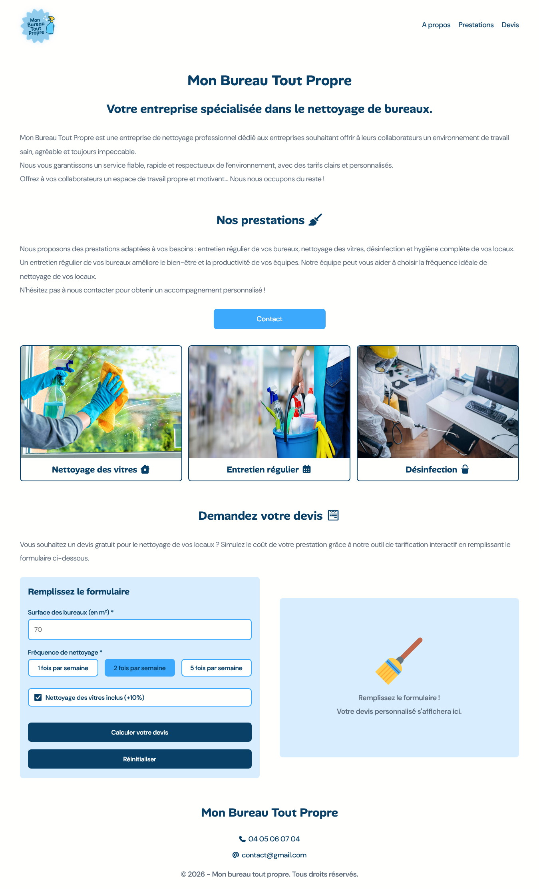
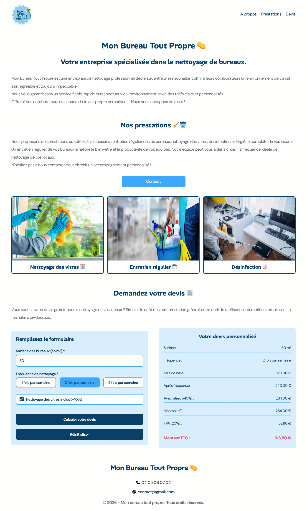

## 🧽 MON BUREAU TOUT PROPRE | SIMULATEUR DE PRIX INTERACTIF

- Avec affichage du devis personnalisé

## Le challenge

Mon Bureau Tout Propre est une entreprise spécialisée dans le nettoyage de bureaux. Elle souhaite proposer à ses clients un simulateur de prix interactif, intégré à son site internet, permettant d’obtenir une estimation claire et rapide du coût des prestations.

Les objectifs de l'entreprise sont :

- Offrir un outil simple, responsive et accessible pour estimer un tarif en ligne.
- Valoriser la transparence tarifaire de l’entreprise.
- Permettre aux clients de comparer différentes options de nettoyage.

## Fonctionnalités

Le simulateur prend en compte :

- La surface des bureaux à nettoyer (en m²)
- La fréquence du nettoyage (1x/semaine, 2x/semaine, ou 5x/semaine)
- Les options supplémentaires (nettoyage des fenêtres)

L'application calcule automatiquement le montant HT, la TVA (20%) et le montant TTC, affichés sous forme de ticket de tarification.

## Tests du simulateur

| Surface | Fréquence  | Vitres | Montant HT attendu | Montant TTC attendu |
| ------- | ---------- | ------ | ------------------ | ------------------- |
| 80 m²   | 2x/semaine | 10%    | 264€               | 316.80€             |
| 150 m²  | 5x/semaine | 0      | 1125€              | 1350€               |

- ✔️ Calcul automatique lors de la modification des champs
- ✔️ Validation des données (valeurs négatives, champs vides)
- ✔️ Réactivité de l'interface
- ✔️ Affichage du devis personnalisé
- ✔️ Formatage des montants (2 décimales, symbole €)

## Contraintes techniques

- Site développé en HTML5, CSS3 et JavaScript (vanilla) sans aucun framework
- HTML5 : structure sémantique de la page
- CSS3 : mise en page d'un design moderne et du responsive
- JavaScript : logique de calcul et affichage dynamique des données
- Code séparé, clair et bien indenté
- Site responsive : compatible ordinateur, tablette, mobile

## Démonstration

Lien vers le projet : https://aperbet56.github.io/mon_bureau_tout_propre/

## Projet développé avec

- Utilisation des balises sémantiques HTML5
- CSS3
- Flexbox
- Grid
- Animations CSS (transition, @keyframes)
- Commentaires HTML
- Commentaires CSS
- Importation d'un normaliseur : le fichier normalize.css
- Importation des polices "Alan Sans" et "DM Sans"
- Desktop first
- Page web responsive
- JavaScript
- Code JavaScript commenté
